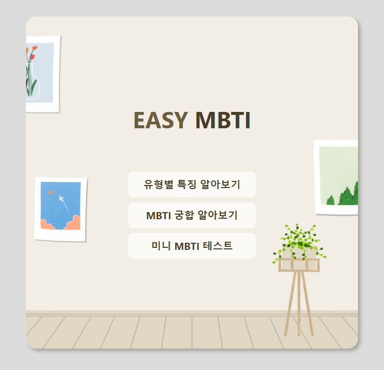
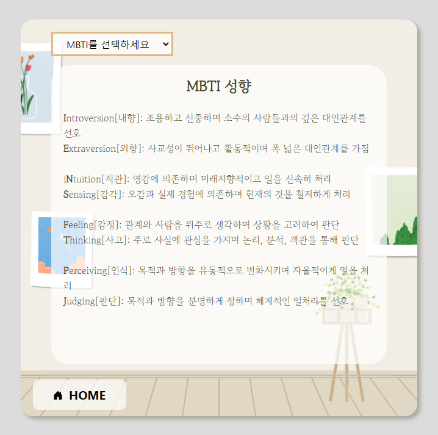
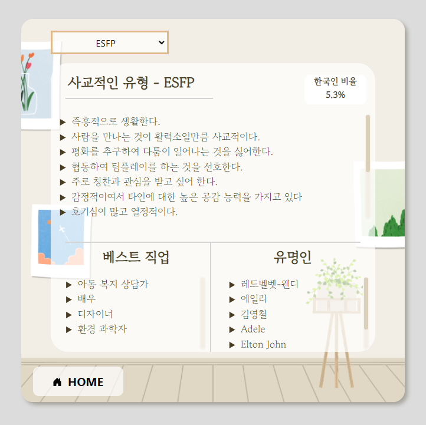
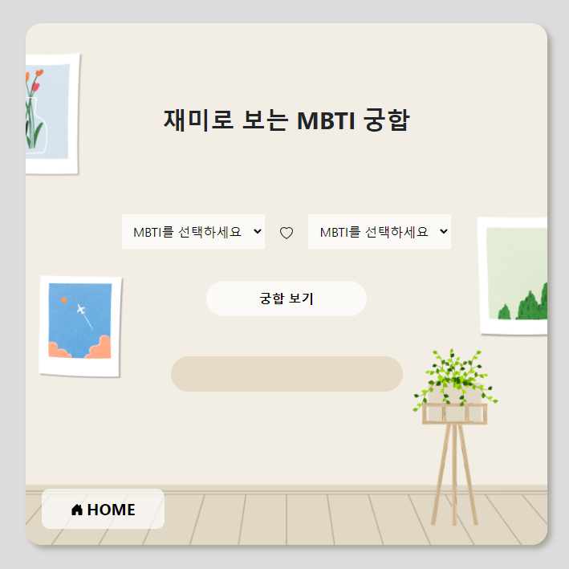
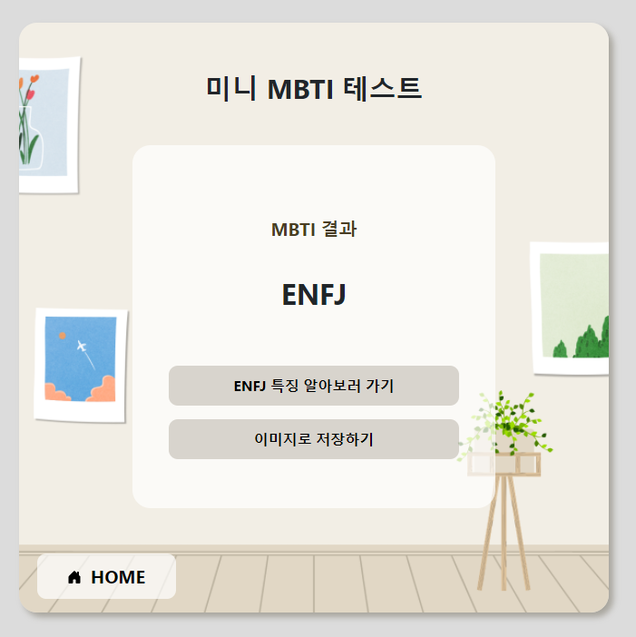

# EASY MBTI  
## 설명  
+ 요즘 유행하는 MBTI를 주제로해서 관련 웹 어플리케이션을 만들었습니다. 시간이 오래걸리는 기존 MBTI검사를 간단한 미니테스트로 만들었고 mbti의 종류와 유형별 특징, 궁합을 알 수 있습니다.
+ index.html 을 메인페이지로 하여 총 3개의 페이지(page1, 2, 3 html)를 만들었고 각 페이지에는 style.css를 적용했습니다.

## 기능
+ 유형별 특징 알아보기
+ MBTI 궁합 알아보기
+ 미니 MBTI 테스트
## 사용 방법
[link](https://ryeowon.github.io/easy_mbti/)로 접속해서 사용하시면 됩니다.  

접속 후:  
1. MBTI를 처음 접하신 분: "미니 MBTI 테스트"부터 진행하여 자신의 MBTI를 쉽게 얻어내시기를 바랍니다.
2. MBTI를 이미 접하신 분: "유형별 특징 알아보기" 또는 "MBTI 궁합 알아보기"를 진행하여 MBTI에 대해 알아보시기를 바랍니다.
## 스크린샷

+ 메인메뉴  
  
+ 유형별 특징 알아보기 클릭
  
  + MBTI 선택 이후
    
+ 재미로 보는 MBTI 궁합 클릭
  
  + 두 가지 MBTI 선택 이후 궁합보기 클릭
    
+ 미니 MBTI 테스트 클릭
  
  + 테스트 결과
    
## 데모 영상
+ [demo video](https://youtu.be/RppGYcuSsD0)
## 기타 사항
+ 한국인 중 MBTI 비율 출처: "MBTI 연구소"
## 멤버
홍여원 (ryeowon13@gmail.com)  
김재영 (a30169123@gmail.com)  
이주용 (wndyd0131@naver.com)  