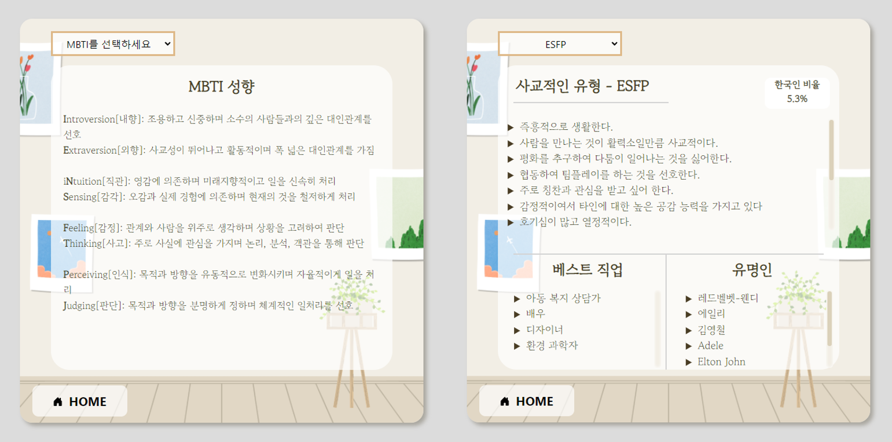
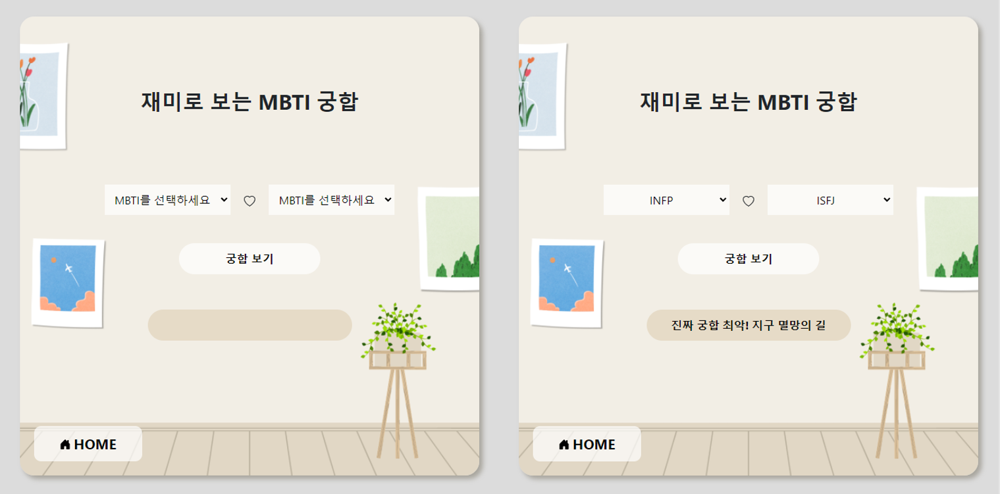
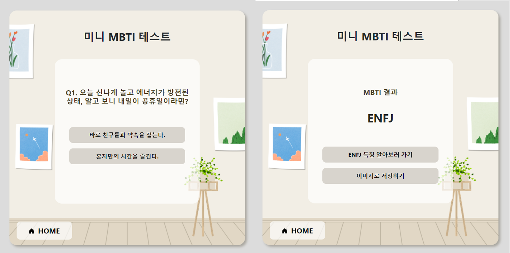

# EASY MBTI v1.3.0
## A Brief Overview  
  EASY MBTI는 MBTI 관련 정보를 제공하는 웹 어플리케이션입니다.  
  빠르게 자신의 mbti를 알아볼 수 있는 미니테스트와 mbti 유형별 특징에 대한 정보를 제공합니다.

## Functions
+ 유형별 특징 알아보기
  - 16가지 유형들의 성격 특성, 베스트 직업, 유명인, 한국인 비율
+ MBTI 궁합 알아보기
  - 총 5가지의 궁합 존재
+ 미니 MBTI 테스트
  - 4개의 질문을 통해 MBTI 도출
  - 결과를 이미지로 저장 가능
## How to Use
[EASY MBTI](https://ryeowon.github.io/easy_mbti/)로 접속합니다.  

접속 후:  
1. MBTI를 처음 접하신 분: "미니 MBTI 테스트"부터 진행하여 자신의 MBTI를 쉽게 알아봅니다.
2. MBTI를 이미 접하신 분: "유형별 특징 알아보기" 또는 "MBTI 궁합 알아보기"를 통해 알고 싶은 정보를 얻습니다.
## Example

+ 메인 메뉴  
  
+ 유형별 특징 알아보기
  
+ 재미로 보는 MBTI 궁합
  
+ 미니 MBTI 테스트
  
  
## Demo Video
+ 어플리케이션 사용법을 자세히 보고 싶으신 분은 아래 링크의 영상을 참고하시기 바랍니다.
  + [https://youtu.be/RppGYcuSsD0](https://youtu.be/RppGYcuSsD0)
## Note
+ MBTI 유형별 한국인 비율은 한국 MBTI 연구소의 통계를 바탕으로 작성하였습니다.
+ 미니테스트의 MBTI 결과는 정확하지 않을 수 있으며, 정확한 결과를 원하시는 분은 공식 MBTI 테스트를 이용하시기 바랍니다.
## Members
ryeowon - 홍여원 (ryeowon13@gmail.com)  
kimjae0 - 김재영 (a30169123@gmail.com)  
wndyd0131 - 이주용 (wndyd0131@naver.com)  